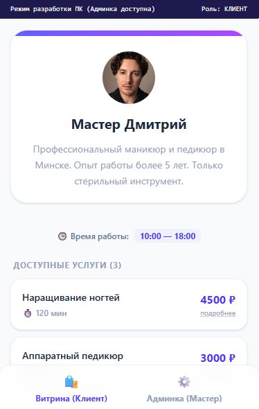
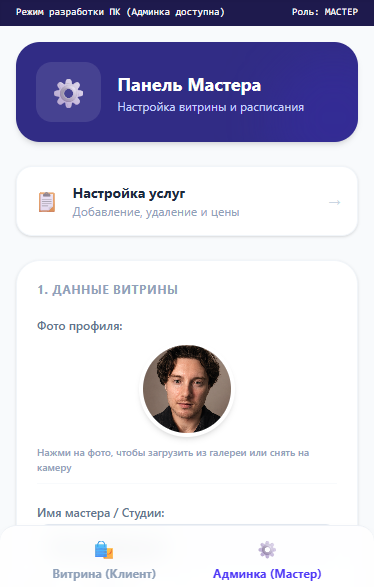

# 💅 МАСТЕР ВИТРИНА

<div align="center">
  
  
</div>

<br />

Автоматизация онлайн-записи для бьюти-мастеров и репетиторов в СНГ.
Полноценное **Telegram Mini App (TWA)** приложение со своей облачной СУБД.


## ⚡ Особенности

- **Бесшовная интеграция:** Запуск прямо внутри чата Telegram без скачивания (TWA SDK).
- **Mobile First UX:** Горизонтальный 30-дневный календарь-лента со свайпом и умные нижние шторки (Bottom Sheets).
- **Секретная Админка:** Авторизация по Telegram ID — панель управления скрыта от обычных клиентов и доступна только верифицированному мастеру.
- **Полный CRUD контента:** Добавление, редактирование описаний, цен, длительности и удаление услуг на лету напрямую в облако.
- **Медиа-хаб:** Нативная загрузка реальных фото профиля из галереи или камеры смартфона с конвертацией в Base64.
- **Реактивный Диспетчер:** Облачный журнал записей клиентов с мгновенным автообновлением через Zustand.

## 🕹 Управление

- **Для Клиента:** Выбор услуги -> Свайп даты -> Выбор времени в шторке -> Нативная кнопка Telegram `MainButton`.
- **Для Мастера:** Нижний Таб-бар для переключения роли -> Мгновенное редактирование инпутов, расписания и прайса.

## 🛠 Технический стек

- **React 19 & Vite** (Ультра-быстрая скорость сборки и загрузки SPA внутри мессенджера).
- **Zustand** (Глобальный стейт-менеджер без лишних ререндеров и раздувания бандла).
- **Supabase & PostgreSQL** (Реальная облачная реляционная база данных для персистентного хранения данных).
- **Tailwind CSS v4** (Современные быстрые стили и плавные нативные анимации выезда шторок).
- **ESLint & Prettier Config** (Строгий линтер, полностью запрещающий тип `any` и каскадные рендеры в эффектах).

## 🚀 Как запустить локально

1. Клонируй репозиторий:
   ```bash
   git clone https://github.com
   ```
2. Установи зависимости:
   ```bash
   npm install
   ```
3. Настрой конфигурацию `src/supabaseClient.ts`:
   ```typescript
   export const supabase = createClient('YOUR_SUPABASE_URL', 'YOUR_SUPABASE_ANON_KEY');
   ```
4. Запусти проект одной командой:
   ```bash
   npm run dev
   ```

## 📜 Планы на будущее

- [ ] Автоматическая отправка уведомлений мастеру в ЛС при новой записи.
- [ ] Фильтрация занятых тайм-слотов (чтобы клиенты не записывались на одно время).
- [ ] Интеграция СНГ-эквайринга (ЮKassa/Продамус) для онлайн-предоплаты.
- [✓] Полный CRUD прайс-листа в реальном времени.
- [✓] Безопасные гварды авторизации по Telegram ID.
- [✓] Сохранение входящих бронирований в облачную базу данных.

