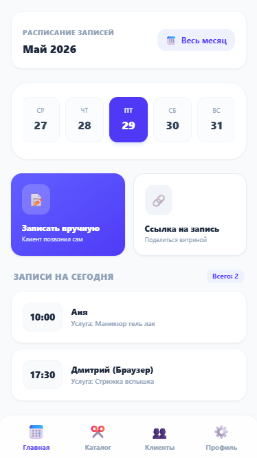
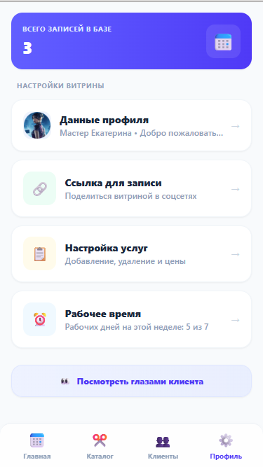
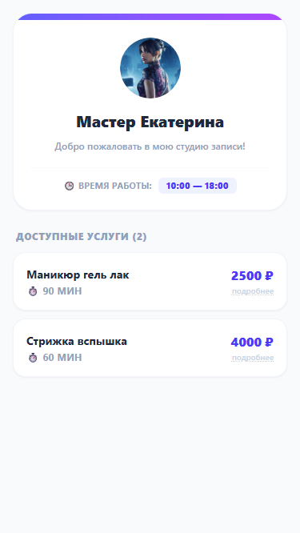
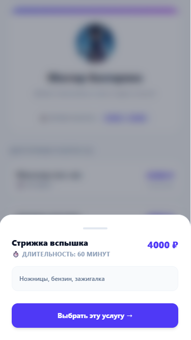

#  МАСТЕР ВИТРИНА — Telegram Mini App (TWA)

Full-stack веб-приложение (Telegram Mini App) для автоматизации онлайн-записи бьюти-мастеров, барберов и независимых специалистов в СНГ, развёрнутое в изолированном Docker-контуре.

<div align="center">
  <table border="0" cellpadding="0" cellspacing="0">
    <tr>
      <td width="24%" align="center" valign="top">
        
      </td>
      <td width="24%" align="center" valign="top">
        
      </td>
      <td width="24%" align="center" valign="top">
        
      </td>
      <td width="24%" align="center" valign="top">
        
      </td>
    </tr>
  </table>
</div>

---

## 🏗 Архитектура приложения

Проект спроектирован по классической трехзвенной схеме и полностью контейнеризирован:

```text
┌────────────────────────────────────────────────────────┐
│              Telegram Mini App (Frontend)              │
│  React 19 / Vite SPA  ➔  Zustand State  ➔  Axios Client │
└───────────────────────────┬────────────────────────────┘
                            │
                            │ API-запросы (JWT Bearer)
                            ▼
┌────────────────────────────────────────────────────────┐
│              Python FastAPI (Backend API)              │
│  SQLAlchemy ORM  ➔  Alembic Migrations  ➔  JWT Guard   │
└───────────────────────────┬────────────────────────────┘
                            │
                            │ Драйвер asyncpg
                            ▼
┌────────────────────────────────────────────────────────┐
│               PostgreSQL 16 (Data Layer)               │
│       Таблицы: user_master, client, services...        │
└────────────────────────────────────────────────────────┘
```
### 💻 Frontend Component (Клиентская часть)
- Развёрнут на **React 19** и **Vite**.
- Локальное состояние и кэширование данных координируются через **Zustand**.
- Стилизация построена на базе **Tailwind CSS v4** с использованием аппаратных анимаций выезда шторок (*Bottom Sheets*).
- Интегрирован **Telegram WebApp SDK**: нативная работа с кнопкой `MainButton`, тактильные микровибрации смартфона через `HapticFeedback` и бесшовное сворачивание TWA при переходе в чат техподдержки.

### 🐍 Backend Component (Серверная часть)
- Высокопроизводительный асинхронный API-сервер на **Python 3.11+ / FastAPI**.
- Безопасность: авторизация по Telegram ID с выдачей защищенных JWT-токенов доступа.
- Работа с базой организована через асинхронный движок **SQLAlchemy (asyncpg)**.
- Контроль структуры таблиц и версионирование схемы данных реализованы через **Alembic**.

### 🛢 Data Layer (Слой данных)
- Реляционная СУБД **PostgreSQL 16 (Alpine)**.
- Архитектура таблиц включает автоматическую генерацию UUID (`gen_random_uuid()`), хранение сложных конфигураций рабочих дней в массивах `JSONB` и каскадное удаление зависимых записей (`ON DELETE CASCADE`).

---

## 🛠 Контур автоматизации и контроля качества (CI/CD)

1. **Тестовая среда (Vitest):** Быстрый запуск юнит- и интеграционных тестов в среде `jsdom`. Написаны сценарии для проверки моков Telegram SDK и фолбэков.
2. **Git Hooks (Husky + lint-staged):** Робот перехватывает команду `git commit`. Он изолирует измененные файлы, форматирует их через `Prettier` по единому стандарту (`.prettierrc`) и запускает тесты. Если тест упал — коммит блокируется.
3. **Строгий TypeScript:** Конфигурация `tsconfig.json` переведена на современный стандарт разрешения модулей `bundler`, включены строгие правила типизации (запрет `any`, контроль switch-case).

---

## 🚀 Быстрый запуск в Docker (Локально)
1. **Клонируйте проект:**
   ```bash
   git clone https://github.com
   cd master-vitrina
   ```
2. **Настройте окружение:**
   Создайте файл `.env` в корне проекта на основе `.env.example` и укажите данные для подключения к БД и токен вашего Telegram-бота.

3. **Запустите всю инфраструктуру одной командой:**
   ```bash
   docker-compose up --build
   ```
   *Docker автоматически соберет бэкенд на FastAPI, поднимет PostgreSQL, применит миграции, скомпилирует фронтенд на React и начнет раздавать его через Nginx на 3000 порту.*

4. **Генерация тестовой CRM-базы (Опционально):**
   Чтобы наполнить админку тестовыми клиентами для проверки аналитики визитов, выполните внутри контейнера бэкенда:
   ```bash
   docker exec -it twa_fastapi python -m src.seed_crm
   ```
